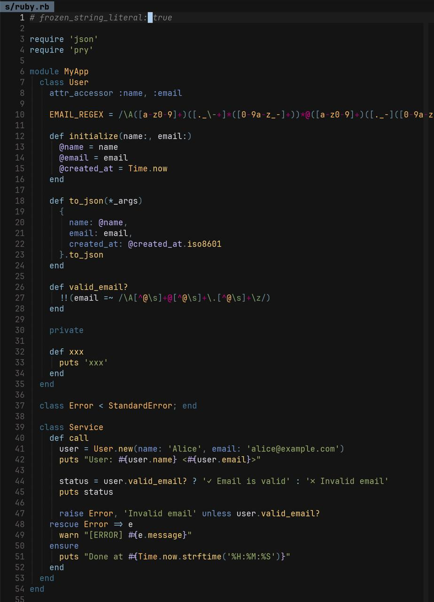
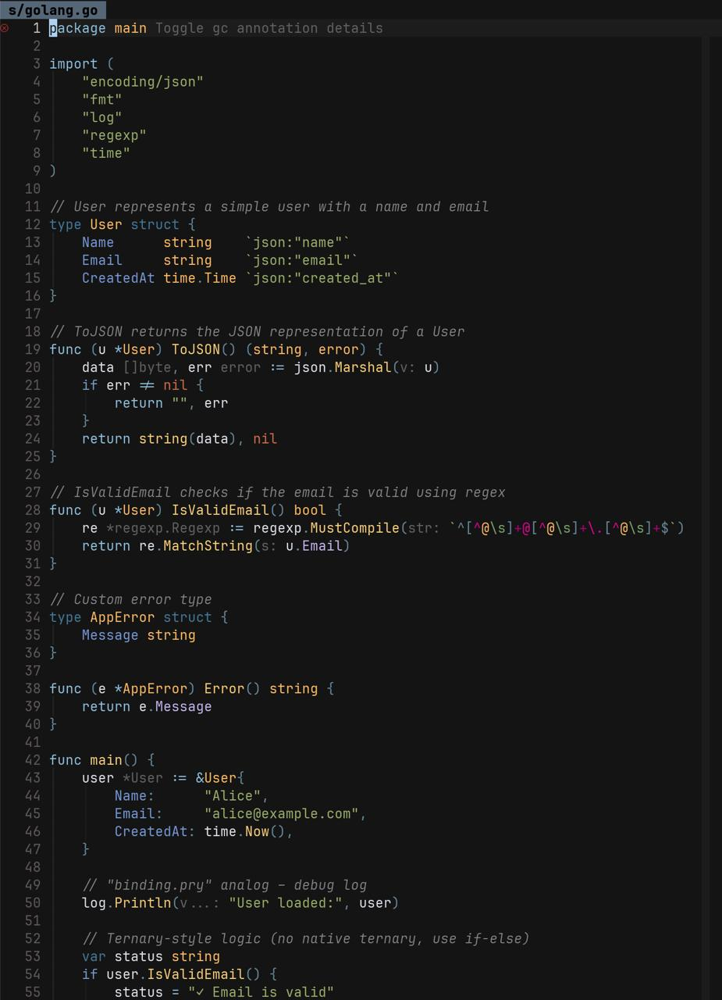

# jellybeans.nvim

Another Lua port of the [Jellybeans colorscheme](https://github.com/nanotech/jellybeans.vim) for Neovim.

Scroll down for [screenshots](#screenshots)

## Notes

- Rewritten for more accurate color matching
- Tree-sitter support added (focused on Go, Ruby, and TypeScript)
- Plugin-specific highlighting for commonly used plugins

## Supported Plugins

- [Telescope](https://github.com/nvim-telescope/telescope.nvim)
- [GitSigns](https://github.com/lewis6991/gitsigns.nvim)
- [Nvim-Tree](https://github.com/nvim-tree/nvim-tree.lua)
- [indent-blankline](https://github.com/lukas-reineke/indent-blankline.nvim)
- [blink.cmp](https://github.com/Saghen/blink.cmp)
- [avante.nvim](https://github.com/yetone/avante.nvim)

## Installation

Please ensure that the termguicolor option in your init.lua file is activated `vim.opt.termguicolors = true`

Using [lazy.nvim](https://github.com/folke/lazy.nvim)

```lua
{
  "b43/jellybeans.nvim",
  lazy = false,
  priority = 1000,
  config = function()
    vim.cmd.colorscheme("jellybeans")
  end,
  dependencies = {
    "rktjmp/lush.nvim", -- required for theme definitions
  },
},
```

## Additional Configuration

### indent-blankline

```lua
{
  "lukas-reineke/indent-blankline.nvim",
  event = "BufReadPost",
  main = "ibl",
  config = function()
    local highlight = {
      "IblOdd",
      "IblEven",
    }
    require("ibl").setup({
      indent = { highlight = highlight },
    })
  end,
},
```

### lualine

```lua
require('lualine').setup {
    options = {
        theme = 'jellybeans'
    }
}
```

## Inspirations

- [jellybeans.vim](https://github.com/nanotech/jellybeans.vim) - Thanks, I've been using this theme since 2014
- [jellybeans-nvim](https://github.com/metalelf0/jellybeans-nvim) by [metalelf0](https://github.com/metalelf0)
- [jellybeans.nvim](https://github.com/WTFox/jellybeans.nvim) by [WTFox](https://github.com/WTFox)
- [tokyonight.nvim](https://github.com/folke/tokyonight.nvim) by [Folke](https://github.com/folke)
- [catppuccin/nvim](https://github.com/catppuccin/nvim) (mocha flavour)

## Screenshots



